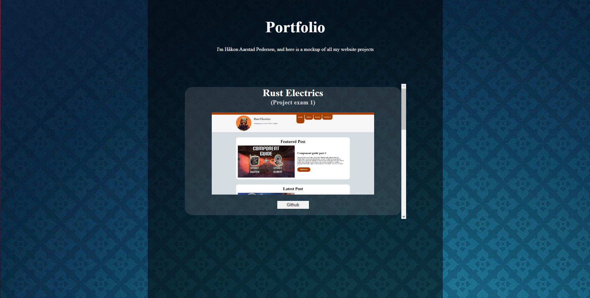

# Portfolio

## Description

Here is my portfolio website design, wanted to use one that i already have for portfolio. but not sure if that would auto-fail the assignement or not.

## Built With

- HTML/CSS/

## Getting Started

### Installing

1. Clone the repo.

### Running

To run the app, do the following:

1. Open the index.html file.

## Contact

You can contact me on [www.mrdigi.tv](https://mrdigi.tv/contact/)
